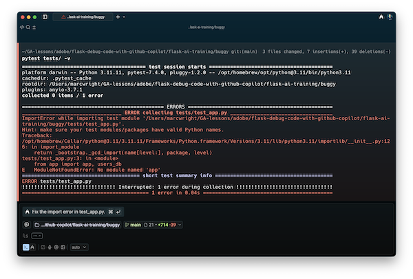
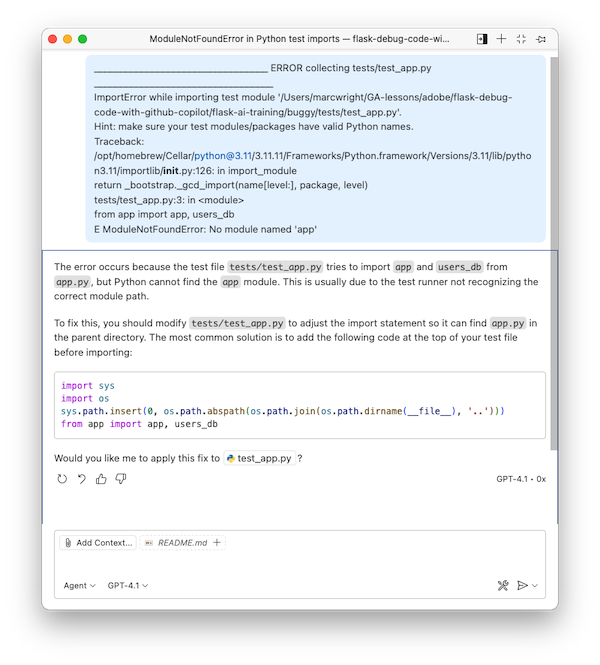
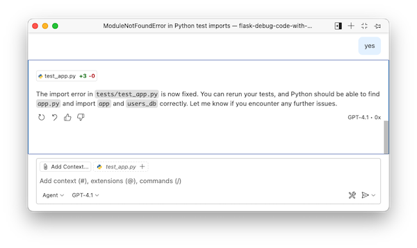
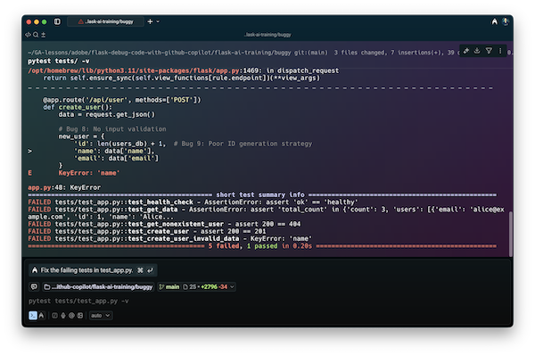
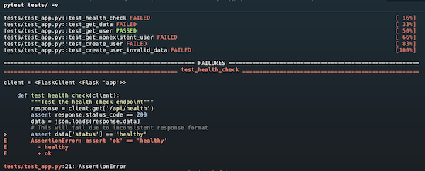
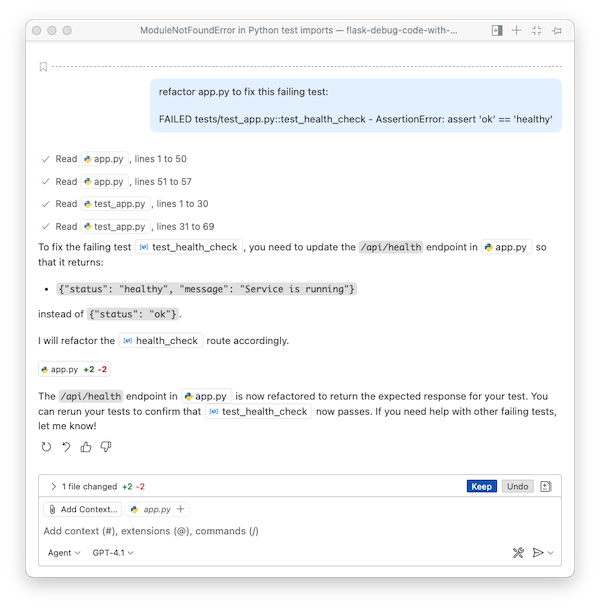
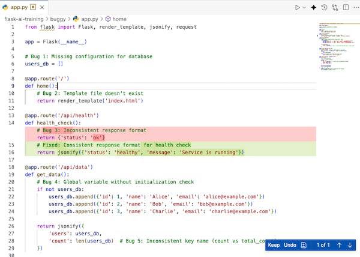
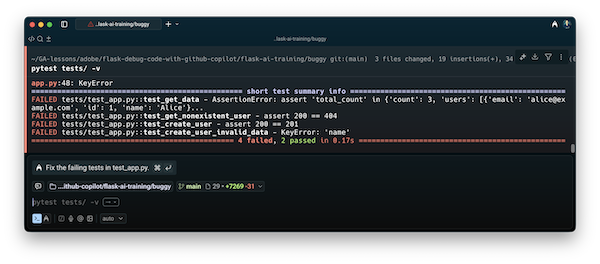

<h1>
  <span class="headline">Debugging A Flask Application Using Unit Tests and GitHub Copilot</span>
  <span class="subhead"></span>
</h1>

## Exercise Goal

The goal is to identify and fix all the bugs to make this application work correctly and pass all tests. You will use the provided unit tests and GitHub Copilot to make all the tests pass.

__NOTE - Your GitHub Copilot responses will not be identical to what is in this README.md. Trust but verify!__


<br>

## Known Issues with `app.py`

This version contains several intentional bugs:

1. **Template Issues**: Missing template files
2. **Response Format Inconsistencies**: Mixed response formats
3. **Input Validation**: Missing validation for user inputs
4. **Error Handling**: Improper HTTP status codes
5. **Type Mismatches**: String/integer comparison issues
6. **Global State Management**: Poor handling of global variables
7. **Security Issues**: Debug mode enabled with public host
8. **Test Issues**: Failing tests due to various bugs

<br>

## API Endpoints

- `GET /` - Home page (will fail due to missing template)
- `GET /api/health` - Health check endpoint (inconsistent format)
- `GET /api/data` - Returns user data (inconsistent field names)
- `GET /api/user/<user_id>` - Get specific user (type validation issues)
- `POST /api/user` - Create new user (missing validation)

<br>

## Run the Unit Test Suite

This app contains 6 unit tests. To start, let's run the test suite and see what passes and/or fails.

  ```bash
  pytest tests/ -v
  ```

  

I appears that the tests won't even run due to an issue. Paste the red text into GitHub Copilot.

  

Allow it to apply the fix (trust but verify!).

  

Now that we've made a change to `app.py` rerun tests to see the results.

  ```bash
  pytest tests/ -v
  ```

It looks like we have 1 passing test and 5 failing tests. The test suite is working and we can move forward.

  

<br>

## Fix a Failing Test

Based on the screenhshot above, we have 1 passing test and 5 failing tests.


In your Terminal, scroll up to see more detail on the failing tests. Specifically, let's start by examining the `test_health_check` failure.

  

There are several ways to create a prompt for GitHub Copilot. Use your best judgement based on the context, complexity and size if your application. 

For example, here is the prompt I used.

```plaintext
refactor app.py to fix this failing test: 

FAILED tests/test_app.py::test_health_check - AssertionError: assert 'ok' == 'healthy'
```

Here is GitHub Copilot's response:

  

Here are the changes it suggested in `app.py`.

  

I sanity checked the code, clicked on "Keep" and saved the file. I ran the tests again and `test_health_check` passes.

  

<br>

## You Do

Following the Debugging example above, see if you can get the other 4 tests to pass.

<br>

## Bonus

Time permitting, debug the [bonus-buggy-flask-app-starter](../bonus-buggy-flask-app) using the same process you used in this Readme.
