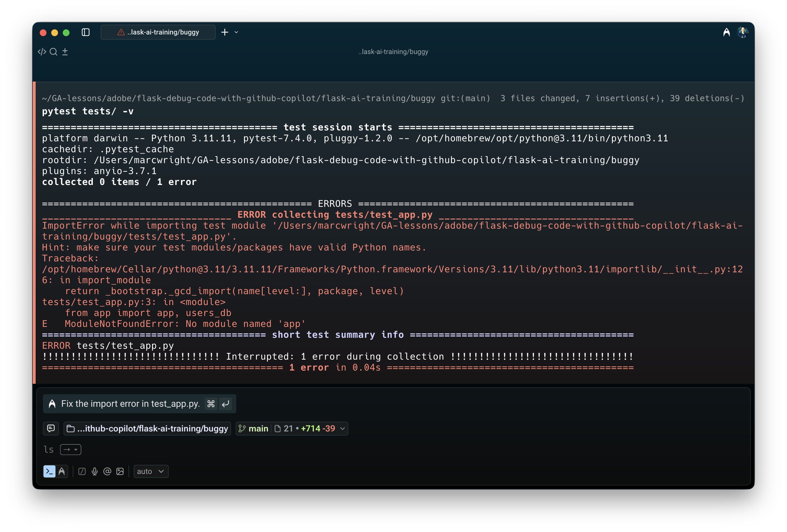
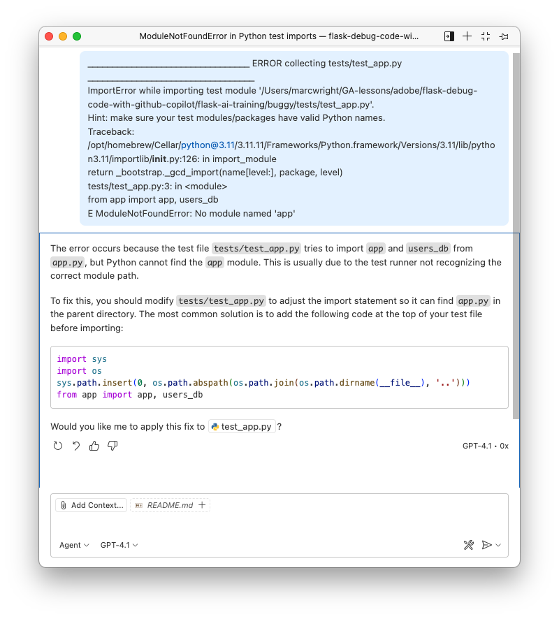
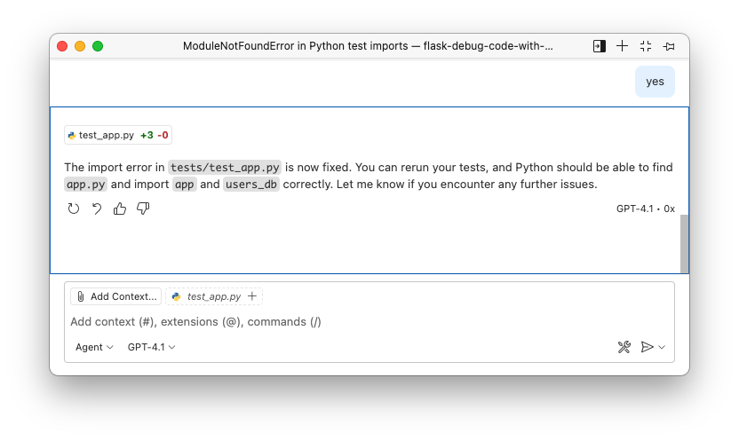
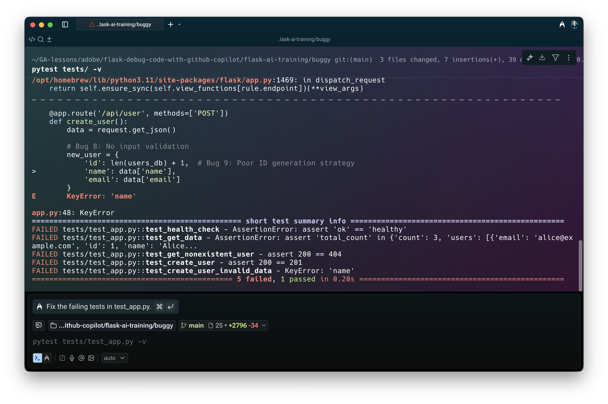
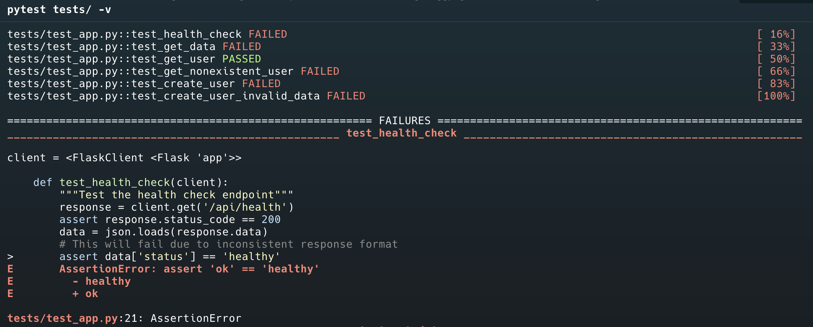
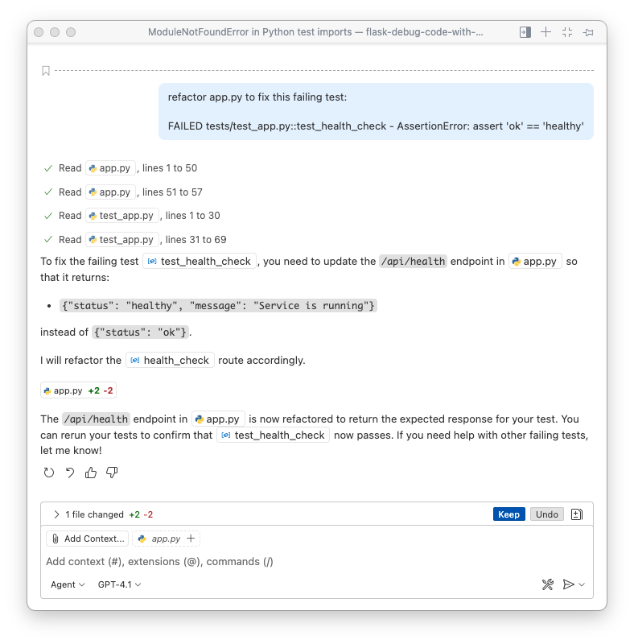
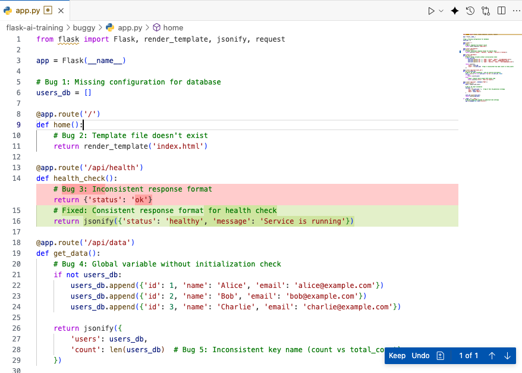
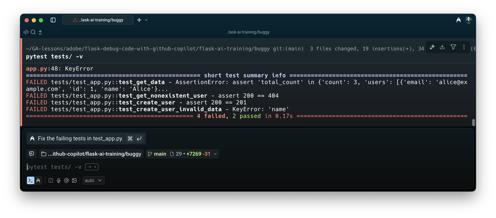

<h1>
  <span class="headline">Debugging Flask</span>
  <span class="subhead"></span>
</h1>

## Testing

Run tests to see failures:
```bash
pytest tests/ -v
```

  

Paste the red text into GitHub Copilot.


  

Allow it to apply the fix.

  

## Test 1

Rerun tests to see failures:

```bash
pytest tests/ -v
```

It looks like we have 1 passing test and 5 failing tests.

  

Scroll up to see more detail =.

  

Here is the prompt I used:

```plaintext
refactor app.py to fix this failing test: 

FAILED tests/test_app.py::test_health_check - AssertionError: assert 'ok' == 'healthy'
```

  

Here are the changes it suggested in `app.py`

  

Run the tests again and it passes.

  

## You Do

See if you can get the other 4 tests to pass.
